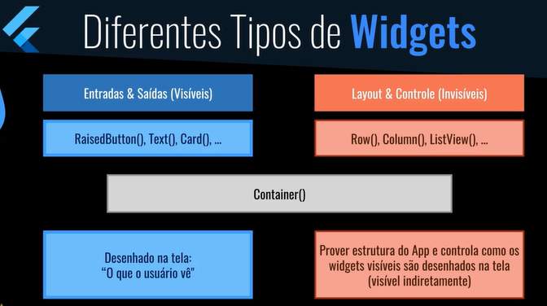

# perguntas_app_flutter
Estudos de Flutter com um app básico de quiz, visando entender os conceitos de widgets.

## criar a aplicação

1. flutter create nome-do-projeto

## iniciar desenvolvimento (lib/main.dart)
1. Função principal (main())
2. Widget principal (StatelessWidget ou StatefulWidget)
3. WIDGETS: MaterialApp (recursos básicos de design Material)
                Scaffold (estrutura principal)
                    AppBar(exibe o cabeçalho)
                    body(corpo da página)
